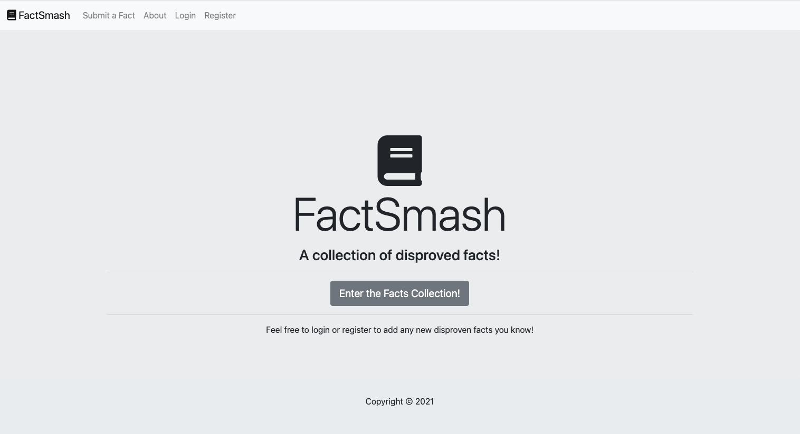
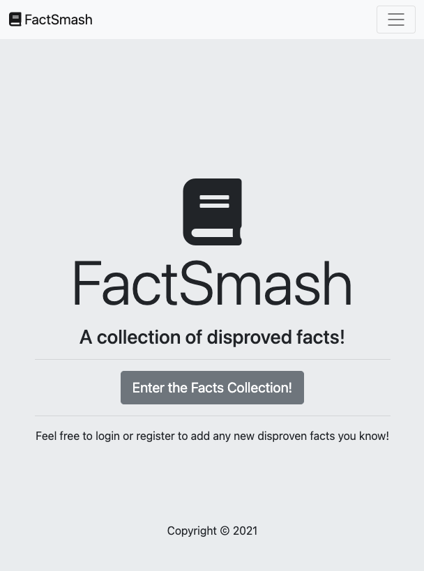
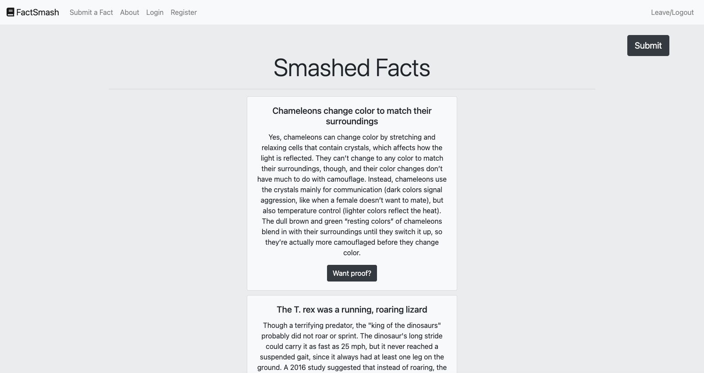
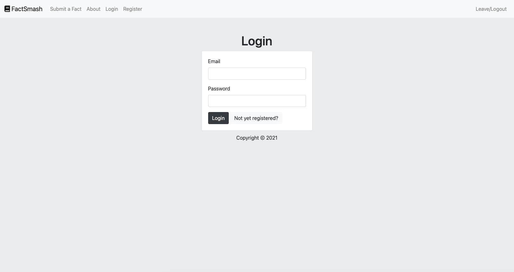
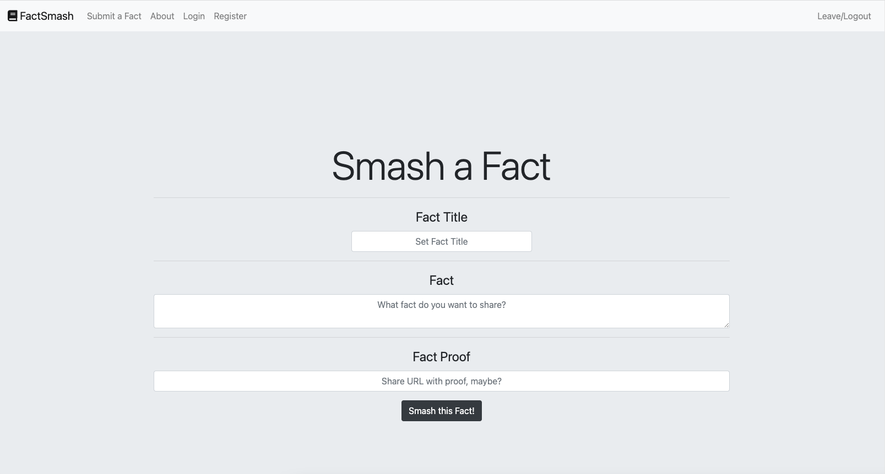

# FactSmash :book: :hammer:
FactSmash is a web applicationg that contains popular facts that have been either proved wrong or have always been wrong. 

User can login/register to add new facts (smash facts) and he can also add a link to the proof. 

It was made with HTML, CSS, JS, Node.JS, Express.JS and Bootstrap. MongoDB Atlas is used as a database. 

Feel free to check it out here: https://agile-beyond-10964.herokuapp.com/ 

You can also see some screenshots below: 

